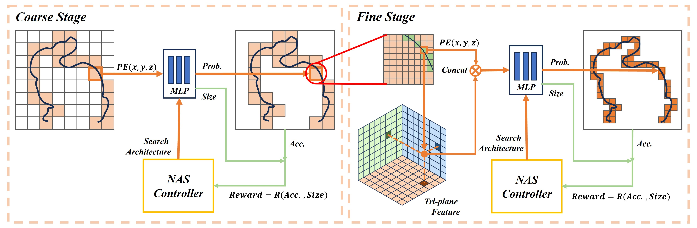
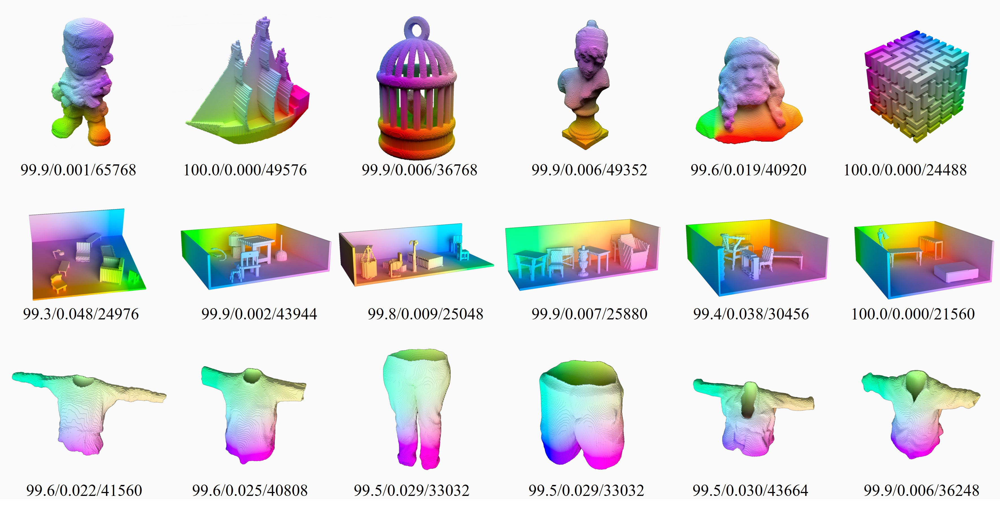

# High-fidelity Voxel Reconstruction via Neural Architecture Search and Hierarchical Implicit Representation

This repository contains the implementation of the paper (under review):

**High-fidelity Voxel Reconstruction via Neural Architecture Search and Hierarchical Implicit Representation.**

__Authors:__ Yulong Wang, Yongdong Huang, Yujie Lu, Nayu Ding, Siyu Zhang, Xianan Xu, Shen Cai*, Ting Lu.



## Methodology

We propose a novel neural architecture search (NAS) based hierarchical voxel reconstruction technique. Leveraging NAS, our method searches a tailored multi-layer perceptron (MLP) network to accurately predict binary classification probabilities of voxels, enabling efficient end-to-end reconstruction of individual voxel models at $256^3$ resolution. We enhance our approach with a hierarchical reconstruction strategy and tri–plane encoding, facilitating the high-fidelity compressed reconstruction. 

The initial conference version of this paper [(Huang et al., 2022)](https://arxiv.org/abs/2202.13313) [[code]](https://github.com/cscvlab/VoxelReconstruction-NAS), presented as an oral representation at ICPR 2022, was limited to a single-stage voxel reconstruction process exclusively for watertight objects. This journal version explores several enhancements aimed at facilitating high-fidelity reconstruction of a broad range of models, including those that are not watertight.

## Dynamic Visualization

| Bird Cage | T-shirt | Room1 |
| :----: | :----: | :----: |
|  |  |  |

| Ship | Pants | Room2 |
| :----: | :----: | :----: |
|  |  |  |

## Other Results
Other voxel reconstruction results at $256^3$ resolution. The models in the first to third rows are watertight objects, indoor scenes and non-watertight clothes, respectively. The values below each model are IoU (\%) $\uparrow$, $\textit{L}_2$-CD ($\times 10^{6}$) $\downarrow$, and the number of network parameters $\downarrow$, respectively.



## Get Started

### Environments

Setup conda environments

```shell
conda env create -f environment.yml
```

Install the dependencies:

```shell
cd dependencies/libdualVoxel
pip install .
```

### Prepare dataset

The mesh models are loaded by trimesh. The voxel is output in *.npz* format.

```shell
python scripts/prepare_dataset.py --mesh_dir data/thingi32 --voxel_out data/thingi32_voxel --name 441708 --resolution 256
```

## Training

```shell
python scripts/train.py --voxel data/thingi32_voxel/256/441708.npz --exp_name logs/441708
```

We put the pre-trained network in `./logs`.


## License

This project is licensed under the terms of the GPL3.0 License (see `LICENSE` for details).


